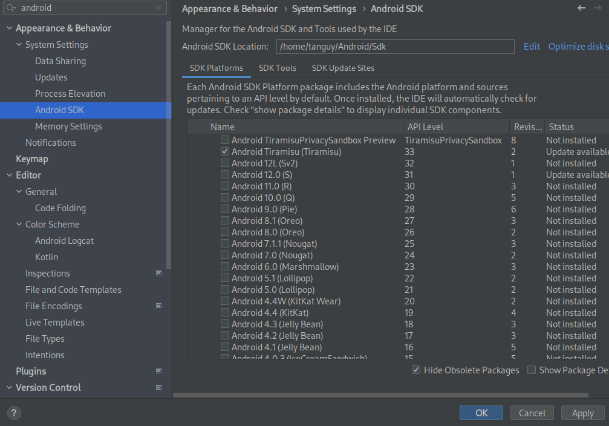

# ENSIMAG Project

## RUN

```sh
// install all the dependencies
npm i

// launch the app
npm run start
npm run android
```

> Before launching the app make sure you have either an android emulator (API level 31>) running or a smartphone connected

```sh
adb devices // to list all connected devices
```

## Android to get ADB and an emulator

Install the following tools :


Please download an API level of your choice, it must be greater or equal to 31.


